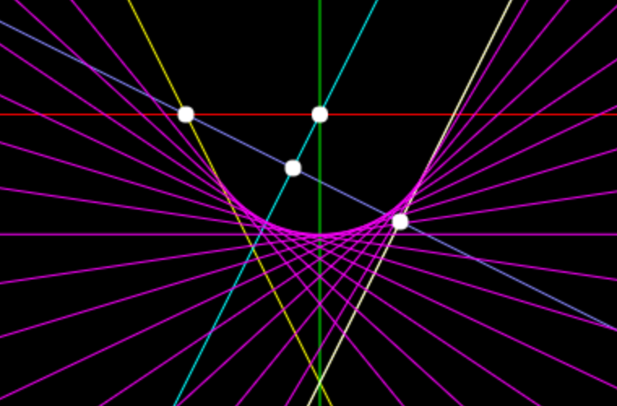

# pga2d

An experiment to implement 2D geometric algebra in ClosureScript.



## Overview

We (Mark Phillips and I) are just beginning.

## Setup

### Using IntelliJ/Cursive

This project is set up for use with Cursive, the IntelliJ plugin for
Clojure(Script) development.  To open the project with Cursive, from
within Cursive choose Open (NOT "Create New Project" or "Import
Project"), and navigate to the directory containing the project.

If this is the first time you have used Cursive with a ClojureScript
project on this computer, you will also need to create a clojure.main
Cursive REPL configuration.  The steps for doing this are:

* Click **Run->Edit** configurations.
* Click the + button at the top left and choose **Clojure REPL**
* Choose a **Local REPL**
* Enter a name in the **Name** field (e.g. "REPL")
* Choose the radio button **Use clojure.main in normal JVM process**
* In the **Parameters** field put `script/repl.clj`
* Click the **OK** button to save your REPL config.

More details are available at
https://github.com/bhauman/lein-figwheel/wiki/Running-figwheel-in-a-Cursive-Clojure-REPL
.


### From the Command Line

To get an interactive development environment run:

    lein figwheel

and open your browser at [localhost:3449](http://localhost:3449/).
This will auto compile and send all changes to the browser without the
need to reload. After the compilation process is complete, you will
get a Browser Connected REPL. An easy way to try it is:

    (js/alert "Am I connected?")

and you should see an alert in the browser window.

To clean all compiled files:

    lein clean
    
    
### Creating a New Diagram

You can create an additional "main" program in the project and set
up an alternate build target and corresponding HTML file for it, so that
you can create, maintain, build, and deploy multiple separate programs from
this same project.  The project contains one alternate main program and build
target called "diagram1".  To create a new "main" program named "myprog", for example,
copy the "diagram1" files and code as follows:

1. Edit the file `project.clj` to find the section that looks like:

   ```clj
   {:id "diagram1"
    :source-paths ["src"]
    :compiler {:output-to "resources/public/js/compiled/diagram1.js"
               :main pga2d.diagram1
               :optimizations :advanced
               :pretty-print false}}
   ```

   Copy/paste this section to create a duplicate of it, and change all
   occurences of "diagram1" to "myprog".
   
2. Copy the file `src/pga2d/diagram1.cljs` to `src/pga2d/myprog.cljs`, then
   edit it to create your new program.  Be sure to change the name in the
   `ns` call at the top from "pga2d.diagram1" to "pga2d.myprog".
   
3. Copy the file `resources/public/diagram1.html` to `resources/public/myprog.html`,
   and edit it to change all occurences of "diagram1" to "myprog".
   
4. Run the build with the command   

   ```
   lein cljsbuild once myprog
   ```
    
5. Open the file `resources/public/myprog.html` in your browser.  If
   you want to deploy the results to a web server, deploy the entire
   "resources/public" directory to the server.

## Production Deployment (Github Pages)

There is a publicly visible copy of this project online at
http://embeepea.github.io/pga2d.  To update that online copy with
the latest changes, do the following:

1. Get into your local copy, if you are not already: 
   ```
   cd pga2d
   ```

2. Make sure that you have committed all outstanding edits, and that you
   have updated your local copy with any new commits from origin, and that
   you have pushed your latest commits to origin: 
   ```
   git add <any edited/added files>
   git commit -m 'log message'
   git pull origin master
   git push origin master
   ```
   
3. Switch to the 'gh-pages' branch: 
   ```
   git checkout gh-pages
   ```

4. Pull from origin to make sure you have the most recent changes to
   the 'gh-pages' branch: 
   ```
   git pull origin gh-pages
   ```
   
5. Merge the latest changes from the master branch into the gh-pages branch: 
   ```
   git merge master
   ```
   
6. Fix any conflicts that arise from the previous step.

7. Examine the current status of your local copy 
   ```
   git status
   ```
   and do whatever is necessary to stage all the relevant changes for a commit.  This
   mostly just means doing `git add` for any modified files, or files that were added
   in the master branch, but in some cases it might also mean running `rm` and/or `git rm` to remove
   the local copy of files that were deleted from the master branch.
   
8. When you're sure that all the relevant changes are staged for commit, do the commit: 
   ```
   git commit -m 'merge master'
   ```
   
9. Push the 'gh-pages' branch to origin: 
   ```
   git push origin gh-pages
   ```
   
10. Switch your local copy back to the master branch for ongoing work.  Do NOT
    forget to do this.  If you stay on the gh-pages branch and make further
    edits, you're likely to screw something up when you try to merge those
    edits into master!
    ```
    git checkout master
    ```
